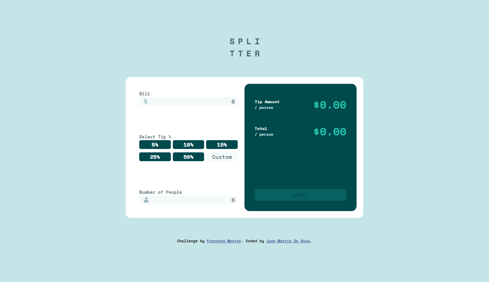

# Frontend Mentor - Tip calculator app solution

This is a solution to the [Tip calculator app challenge on Frontend Mentor](https://www.frontendmentor.io/challenges/tip-calculator-app-ugJNGbJUX). 

### The challenge

Users should be able to:

- View the optimal layout for the app depending on their device's screen size
- See hover states for all interactive elements on the page
- Calculate the correct tip and total cost of the bill per person

### Screenshot

### Links

- Solution URL: [GitHub](https://github.com/juanmderosa/tip-calculator-app)
- Live Site URL: [GitHub Pages](https://juanmderosa.github.io/tip-calculator-app)

### Built with

- Semantic HTML5 markup
- CSS custom properties
- Flexbox
- Responsive Design Workflow
- Vanilla JS

## Author

- Website - [juanmderosa-developer](https://juanmderosa-developer.com/)
- Frontend Mentor - [@juanmderosa](https://www.frontendmentor.io/profile/juanmderosa)
- Linkedin - [Juan Martín De Rosa](https://www.linkedin.com/in/juanmderosa/)

